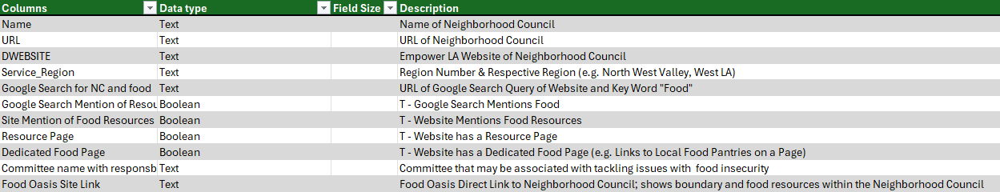

# Food Oasis Neighborhood Council 
### Hack for LA Data Science Community of Practice

## Collaborators

* **Tom Pham** [Active]
* **Shienny S** [Active]
* **Chenxi Wang** [Active]
* **Megh Dave** [Active]

## ​​Project Overview
This project focuses on identifying gaps in food resource information provided by Neighborhood Councils in the Los Angeles County. Neighborhood Councils, the closest form of government to the people, advocate for their communities with City Hall on important issues like development and homelessness. With 99 Neighborhood Councils across Los Angeles, each serving about 40,000 people, their ability to share local food resources is critical. 

### **Neighborhood Council Food Resource Avaialability**
**Analysis**: Identify which Neighborhood Councils already have dedicated food resource pages versus those that do not. This will help reveal current gaps in the availability of food-related information across Los Angeles
**Goal**: Highlight the neighborhoods that lack easy access to food resources online and make a compelling case for why they should embed the Food Oasis site or provide a link to the website

## Stakeholder(s)
* **Food Oasis Outreach Team**
* **Neighborhood Council Officers & Board Members**

## Dataset Source(s)
* Collected open source data from data.la.gov 
* A data set of Los Angeles Neighborhood Council Food Resources

**Update Frequency**: this dataset has been collected on October 2024 and has not been updated

[Viewable Link to Dataset](https://docs.google.com/spreadsheets/d/1bO-gkzcgEUwz8N_2Uj_RBo3bSUyXiFdMBVyCVgo72Ks/edit?usp=sharing)

### Data Dictionary 

## Research Question(s) and Purpose
Define the core questions driving the analysis and the specific outcomes sought. Which questions are you hoping to answer with the data?

* What percentage of NCs do not have any mention of food srources, and are there common characterisitics among them? (average household income, socio-economic indicators such as Food Stamps)
* How do NCs with dedicated food resouce pages compare to those without? 
* Are there correlations between neighborhoods with high food security and the lack of food resource pages?
* How does the availabiliy of food source information vary by region?
* Which neighborhoods would benefit most from embedding the Food Oasis site based on a high need for food resources but low information availability?
    * Can we rank NCs by urgency?

## Visualization

**Google Looker Dashboard (In Progress)**  
[View Dashboard](https://lookerstudio.google.com/reporting/75a14933-c58e-4089-a1b9-a74f4517272d)

## Project Timeline
Provide key milestones and soft deadlines, detailing each stage of the analysis.

* **Data Cleaning & EDA**: Soft Deadline - 11/12/24
* **Dashboard Completion with GeoSpatial Data**: Soft Deadline - 11/19/24

## Final Deliverable
Specify the format of the deliverable (e.g., report, dashboard) and the insights it will present.
* The final deliverable will be a completed dashboard, GitHub Repo, which will be shared on LinkedIn and the Hack for LA platform, presenting insights into food resource availability across Los Angeles 

